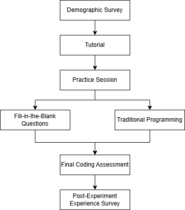

# Towards Mobile Learning: The Tradeoffs of Practicing via Fill-in-the-Blank vs Traditional Programming Problems

This repository contains the data used to calculate metrics, generate figures, and analyze statistical relationships between variables in the study "Fill-in-the-blank vs Real Programming: A Comparative Analysis to Find Best Approach to Learn Programming."

The paper files directory contains all the necessary data and graphs used in the paper.

The figure below illustrates the structure of our project.

