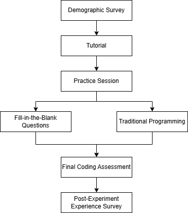

# Towards a Framework for Sequencing Scaffolded Practice: Fill-in-the-Blank vs. Open-ended Programming Problems

This repository contains the data used to calculate metrics, generate figures, and analyze statistical relationships between variables in the study "Towards a Framework for Sequencing Scaffolded Practice: Fill-in-the-Blank vs. Open-ended Programming Problems"

The dataset directory contains all the necessary data used in the paper.

The tutorial video directory contains two videos we shared with the participants for learning.

The questionnaire directory contains all the questions used in this experiment.

Python code files contains all the necessary code we needed to formulate the dataset.

The figure below illustrates the structure of our project.

